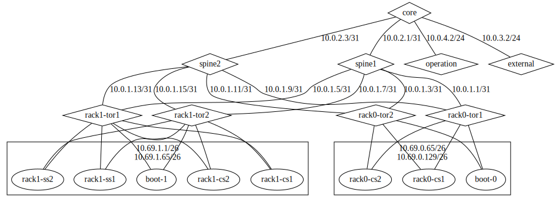

# placemat-viz

[](https://circleci.com/gh/cybozu-go/cke)

Visualization tool for [Placemat](https://github.com/cybozu-go/placemat).

## Requirements

- Graphviz (with `dot` CLI command)
- `cluster.yml` 
  - Resource file for Placemat
  
## Installation

```console
$ go get -u github.com/dulltz/placemat-viz/placemat-viz
```

## Usage

Generate a figure from cluster.yml

```console
$ placemat-viz --input cluster.yml | dot -T svg > output.svg
```

Output example from this [cluster.yml](https://github.com/cybozu-go/placemat-menu/blob/52a4380f3de5451494aa681df6c49c03a091a82a/testdata/cluster.yml):


